# ReconResolve — Migration Reconciliation Root-Cause Analysis

[](https://github.com/ankitad-db/lakebridge-rca/actions/workflows/ci.yml)


**ReconResolve automates the root-cause analysis of data-migration reconciliation
mismatches.** Reconciliation (e.g. [Lakebridge](https://github.com/databrickslabs/lakebridge))
tells you **what** differs between your source warehouse and Databricks — row- and
column-level. ReconResolve tells you **why**, and — critically — whether each difference is a
**migration defect to fix** or a **genuine data difference** that is not a migration problem
at all.

It works for **any Lakebridge-supported source** (Snowflake, Oracle, Teradata, SQL Server,
Synapse, …) via a dialect-driven knowledge base; Snowflake is the tested reference bed.

Every verdict is **backed by an executed query** — never a bare model guess. A fast
deterministic engine resolves the known mismatch mechanisms; an LLM (Databricks Genie Code)
widens coverage for the residual and writes the plain-English narrative — always confirmed
by a query before anything is promoted.

---

## How it works — end to end

The same engine powers three entry points. You start with a `recon_id` (or let ReconResolve
run the reconciliation for you); the pipeline ingests the recon output, classifies each
finding deterministically, confirms it with a live query, enriches it (drift, lineage,
suggested fixes), escalates only the residual to the LLM, and publishes a reviewer-ready RCA
notebook.

```mermaid
flowchart TB
    classDef entry fill:#1B3139,stroke:#FF3621,stroke-width:2px,color:#fff;
    classDef store fill:#0b2d2f,stroke:#00A972,color:#fff;
    classDef out   fill:#26332d,stroke:#00A972,color:#fff;
    classDef dec   fill:#3a2a12,stroke:#FFAB00,color:#fff;

    %% ---------- 1. Entry points ----------
    subgraph ENTRY["① Entry point — choose one"]
        direction LR
        G["🧞 Genie Code skill<br/>Agent mode<br/>skill/rca-recon/SKILL.md"]:::entry
        C["⌨️ CLI<br/>python -m rca_engine.cli"]:::entry
        A["🖥️ Databricks App<br/>app/ · FastAPI + React"]:::entry
    end

    RID{"Already have<br/>a recon_id?"}:::dec
    G --> RID
    C --> RID
    A --> RID

    %% ---------- 2. Reconcile (detection) ----------
    subgraph RECON["② Reconciliation — detection (produces recon_id)"]
        JK{"Join keys<br/>supplied?"}:::dec
        AUTO["Auto-detect join keys<br/>bounded attempts · rca_engine/reconcile.py"]
        LB["Lakebridge reconcile<br/>OR app-native rca_engine.reconcile"]
        OUT[("recon output tables<br/>main · metrics · details")]:::store
        JK -- "no" --> AUTO --> LB
        JK -- "yes" --> LB
        LB --> OUT
    end
    RID -- "no · run recon" --> JK
    RID -- "yes" --> ING
    OUT --> ING

    %% ---------- 3. Tier-1 deterministic ----------
    subgraph T1["③ RCA Tier-1 — deterministic engine (rca_engine/)"]
        ING["ingest_with_summaries()<br/>ingest.py → findings + summaries"]
        MAP["Overlay code context · lakebridge.py (sqlglot)<br/>recon config · transpiled SQL · source DDL"]
        CLS["classify_all()<br/>probes/ + knowledge/&lt;dialect&gt;.yaml<br/>→ category · verdict · confidence"]
        MEM{"use_memory?"}:::dec
        APM["apply_memory()<br/>learned priors (gated)"]
        DD["run_drilldown()<br/>live confirming query per finding"]
        ING --> MAP --> CLS --> MEM
        MEM -- "yes" --> APM --> DD
        MEM -- "no" --> DD
    end

    %% ---------- 4. Enrichment ----------
    subgraph ENR["④ Enrichment — live and defensive"]
        DR["run_drift()<br/>distribution shift"]
        LIN["run_lineage() + run_blast_radius()<br/>system.access lineage<br/>+ depth-agnostic upstream trace-back"]
        FIX["generate_fixes()<br/>runnable remediation"]
        VF["validate_all_fixes()<br/>fix-validation gate → ✅ validated"]
        CLU["build_clusters()<br/>one mechanism → many findings"]
        DR --> LIN --> FIX --> VF --> CLU
    end
    DD --> DR

    %% ---------- 5. Tier-2 LLM fallback ----------
    RESID{"Residual needs-review /<br/>unknown, or a gap-case fix?"}:::dec
    CLU --> RESID
    subgraph T2["⑤ RCA Tier-2 — LLM fallback (Genie Code / FM endpoint)"]
        PROP["Propose cause + confirming query<br/>resolve.resolve_finding()"]
        CQ{"Query<br/>confirms?"}:::dec
        PROMOTE["Promote verdict<br/>(query-backed)"]
        NR["Keep as 🔍 Needs review<br/>+ suggested next check"]
        SETFIX["Corrected SQL for transpilation/unknown<br/>resolve.set_fix() (validated)"]
        NARR["Grounded narrative<br/>synthesize.set_narrative()"]
        PROP --> CQ
        CQ -- "yes" --> PROMOTE --> SETFIX --> NARR
        CQ -- "no" --> NR --> NARR
    end
    RESID -- "yes" --> PROP
    RESID -- "no" --> RPT
    NARR --> RPT

    %% ---------- 6. Output ----------
    subgraph OUTS["⑥ Output — report.py · write_rca_bundle()"]
        RPT["Assemble RCA bundle"]
        NB["📓 rca_&lt;recon_id&gt;/<br/>index + per-table notebooks"]:::out
        SUM["📄 SUMMARY.md<br/>paste into ticket / Slack"]:::out
        JSON["🧾 rca_&lt;recon_id&gt;.json"]:::out
        AUD[("🧭 append-only audit table<br/>audit.py")]:::store
        RPT --> NB
        RPT --> SUM
        RPT --> JSON
        RPT --> AUD
    end
```



**Legend** — rounded/dark = entry points · amber diamonds = decisions · cylinders = data
stores · green = published outputs. Tier-1 is fully deterministic and reproducible; Tier-2
(LLM) only runs for the residual and only promotes a verdict when a live query confirms it.

---

## Verdicts — the field a human acts on

Every finding gets a verdict, separate from its technical category:

| Verdict | Meaning | Owner |
|---|---|---|
| 🔧 **Migration-induced** | Fix in the migration — code/transpilation, type/schema, pipeline, environment. | Migration engineer |
| 📊 **Genuine data difference** | Real source/upstream difference; **not** a migration bug. | Data owner / source team |
| ✅ **Benign / expected** | Formatting-only or within tolerance. | No action |
| 🔍 **Needs review** | Evidence inconclusive within the query budget. | Analyst (next check provided) |

Each finding is cross-confirmed by up to **five independent sources**: recon data · target
code · declared source types · Unity Catalog lineage · a live confirming query.

### Upstream trace-back (depth-agnostic)

When Unity Catalog lineage is enabled (`use_uc_lineage: true`), ReconResolve doesn't stop at
the reconciled table. It **walks lineage upstream hop by hop to the root layer** — following
*column* lineage where a column is known, *table* lineage otherwise — so a defect introduced
several layers back (e.g. a bad `ROUND`/`CAST`/join in an intermediate staging or transform
table) is pointed at directly rather than blamed on the target. The walk is **not fixed to any
number of layers**: it follows the real pipeline depth, is cycle-safe, and is bounded only by
`max_lineage_hops` (default 10) as a safety budget. Each finding gets a
`Lineage trace-back (N hops to root …)` evidence line with the full path. Where lineage is
missing or broken, the Tier-2 LLM continues the walk by proposing and executing confirming
queries at each upstream layer — so the verdict stays query-backed at whatever layer the
difference actually entered.

### Job-level source-column trace (`trace_job` / `--trace-job`)

Reconciliation works at the **table** level; this pass goes one level up to the ETL **job**
that builds the target. For each mismatching column it finds that job — from
`system.access.table_lineage` (the same system tables the UC-lineage pass reads), or a
pinned `job_id` — exports its notebook SQL, parses it with **sqlglot**, and walks the
column back to its **true source `table.column`(s)** with the transform at every hop.
Because ETL renames and computes columns (e.g. `eff_routing_yield` is `EXP(SUM(LN(…)))`
over two *different* source columns, not a column that exists in any source table), the
mismatching target column rarely maps to a same-named source column — this trace finds the
ones it actually derives from. It then attaches a **runnable reproduction query** (the
temp-object chain inlined as CTEs, restricted to the sampled row) that recomputes the value
from source, so you can compare it to the target value and see where the ETL diverges. This
complements UC lineage (metadata: *which* upstream) with the SQL-derived *how/why*, and
works even where UC column lineage was never captured.

## Suggested fixes (and the validation gate)

For each finding ReconResolve attaches a **concrete, runnable fix** — a corrected transform
expression, a back-fill / de-dup load statement, or a recon-config normalization. Each fix
carries a **validation query**: it is marked **✅ validated** only when a query proves the
entire gap is explained by the mechanism the fix corrects. LLM-written fixes (for the
transpilation / unknown gap cases) pass through the **same** gate — nothing is presented as
trusted without a query.

---

## Repository layout

```
rca_engine/            # source-agnostic diagnostics package — the engine
  discovery.py         #   list recent recon runs so a user can pick a recon_id
  reconcile.py         #   app-native reconciliation (auto join-keys, isolates pairs)
  ingest.py            #   read recon main/metrics/details → findings + summaries
  probes/              #   numeric · temporal · string · null/boolean · semi-structured
  knowledge/           #   per-dialect KB (snowflake · oracle · teradata · mssql · synapse)
  classify.py          #   signals + KB → category + verdict + confidence  (Tier-1)
  lakebridge.py        #   parse recon config / transpiled SQL / source DDL (sqlglot)
  memory.py            #   learning loop — confirmed causes become gated priors
  drilldown.py         #   live confirmation queries → finalize verdicts
  drift.py             #   distribution-shift quantification
  lineage.py           #   UC lineage: depth-agnostic upstream trace-back + downstream blast radius
  mismatch_trace.py    #   job-level trace: parse the building job's ETL SQL (sqlglot) → true source columns + reproduction query
  fixgen.py            #   runnable suggested fixes + fix-validation gate
  cluster.py           #   group findings that share one systemic root cause
  resolve.py           #   Tier-2 LLM fallback + gated LLM fix proposal
  synthesize.py        #   grounded, LLM-authored analyst narrative
  severity.py          #   impact-based severity (verdict × blast radius × confidence)
  report.py            #   TL;DR + top-priorities + per-table notebooks + SUMMARY.md + JSON
  audit.py             #   append-only audit trail of every reconcile & RCA step
  runners.py           #   QueryRunner: Spark (notebook) + Statement API (local)
  cli.py               #   `rca-run` entry point (+ `--list` discovery)
skill/rca-recon/       # the Genie Code skill (SKILL.md, config.yml, vendored engine)
app/                   # Databricks App: self-serve UI over the engine (FastAPI + React)
migration/             # realistic Snowflake→Databricks test bed (see migration/README.md)
tests/                 # deterministic pytest suite (no workspace needed)
scripts/               # validate_scenarios.py — integration harness vs the ground-truth oracle
docs/                  # one-pagers + pitch layout
```

## Prerequisites

- **Python** 3.10+ and [`uv`](https://docs.astral.sh/uv/) or `pip`.
- **Databricks CLI** authenticated to your workspace (`databricks auth login`) with a profile
  and a **SQL warehouse**.
- **Unity Catalog** access to the reconcile output and the source/target tables.
- **Lakebridge** (`databricks labs install lakebridge`) — only needed to *produce* a
  `recon_id`; ReconResolve can also run the reconciliation itself (see the App / `reconcile.py`).

## Installation (development)

```bash
git clone https://github.com/ankitad-db/lakebridge-rca.git
cd lakebridge-rca

python -m venv .venv && source .venv/bin/activate      # or: uv venv && source .venv/bin/activate
pip install -e ".[dev,code,databricks]"                # engine + tests + sqlglot + connector
```

Verify the install:

```bash
make test        # or: pytest
make lint        # or: ruff check .
```

## Quickstart

### A. As a Genie Code skill (primary, agentic path)
Sync the skill (vendors the engine into the skill folder, then imports it to your workspace):

```bash
./sync_skill.sh <profile>
```

In Databricks **Genie Code (Agent mode)** the `rca-recon` skill is auto-discovered. Give it a
`recon_id`; it generates the RCA notebook, asks for your approval, then runs every cell live.
Configuration (catalog/schema/dialect/output location/optional artifacts) lives in
[`skill/rca-recon/config.yml`](skill/rca-recon/config.yml).

### B. Locally, against a reconcile run (CLI)

List recent runs, then analyze one:

```bash
# discover recon_ids
python -m rca_engine.cli --list \
  --recon-catalog <catalog> --recon-schema reconcile \
  --warehouse-id <WAREHOUSE_ID> --profile <profile>

# analyze
python -m rca_engine.cli \
  --recon-id <RECON_ID> \
  --recon-catalog <catalog> --recon-schema reconcile \
  --dialect snowflake \
  --warehouse-id <WAREHOUSE_ID> --profile <profile> \
  --output-dir rca_out
# optional code-aware inputs:
#   --recon-config <path> --transpiled-output <dir> --source-scripts <dir> \
#   --transpile-errors <file> --use-lineage --max-lineage-hops 10 --combined-notebook \
#   --trace-job [--job-id <id>]   # trace each column mismatch through the building job's ETL SQL
```

Produces a self-contained `rca_out/rca_<recon_id>/` folder: `00_index.ipynb`
(overview + severity-ranked **top priorities** + per-table routing), a shareable
`SUMMARY.md`, `rca_<recon_id>.json`, and one notebook per reconciled table. Add
`--combined-notebook` for a single-scroll `rca_<recon_id>_all.ipynb`.

### C. As a Databricks App (self-serve UI)

A Databricks-themed web UI over the same engine — trigger a reconcile, pick a `recon_id`, see a
dashboard, drill into any table, export. Ships with committed demo bundles so it runs with zero
workspace setup:

```bash
cd app/frontend && npm install && npm run build && cd ..
pip install -r requirements.txt
python -m uvicorn app:app --reload --port 8000     # open http://localhost:8000
```

See [`app/README.md`](app/README.md) for pages, configuration, and deployment.

### D. Run the tests (no workspace needed)

```bash
pytest                       # deterministic unit tests
```

## End-to-end setup (test bed → recon → RCA)

To exercise the full pipeline on the bundled Snowflake→Databricks test bed:

1. **Deploy the test bed** — see [`migration/README.md`](migration/README.md). In short:
   ```bash
   cd migration
   python run_sql.py --file source_sim/02_create_source_sim.sql --warehouse-id <WID> --profile <profile>
   python run_sql.py --file target/10_target_ddl.sql             --warehouse-id <WID> --profile <profile>
   python run_sql.py --file pipeline/21_silver_transform.sql     --warehouse-id <WID> --profile <profile>
   python run_sql.py --file pipeline/22_gold_aggregate.sql       --warehouse-id <WID> --profile <profile>
   # comprehensive edge cases:
   python run_sql.py --file edge_cases/40_edge_source.sql        --warehouse-id <WID> --profile <profile>
   python run_sql.py --file edge_cases/41_edge_target.sql        --warehouse-id <WID> --profile <profile>
   ```
2. **Configure + run Lakebridge reconcile** (using `migration/recon/30_reconcile_config.json`)
   to produce a `recon_id`. Details in `migration/README.md`.
3. **Run the RCA** — invoke the skill in Genie Code with the `recon_id` (A), or the CLI (B).
4. **Validate against the oracle** (optional, CI-style):
   ```bash
   python scripts/validate_scenarios.py --recon-id <RECON_ID> --warehouse-id <WID>
   ```

## Configuration reference (`skill/rca-recon/config.yml`)

| Key | Purpose |
|---|---|
| `recon_catalog`, `recon_schema` | where reconciliation writes its output |
| `dialect` | source EDW dialect → selects the knowledge base |
| `output_dir` | where the RCA notebook lands (bare name → user home; absolute → UC Volume/Workspace) |
| `warehouse_id` | SQL warehouse (local/CLI runs) |
| `recon_config_path` | recon config JSON (join keys, column mapping, filters) — *the mapping* |
| `transpiled_output_dir` | transpiled/target Databricks SQL — per-column transforms |
| `source_scripts_dir` | original-dialect DDL — declared source types |
| `transpile_error_file` | transpile error report |
| `tables:` | explicit per-table source/target script manifest (overrides folder scans) |
| `use_uc_lineage` | attach UC lineage evidence + walk a depth-agnostic upstream trace-back to the root layer (default: false) |
| `max_lineage_hops` | safety budget for the trace-back walk depth (default: 10; stops early at the roots) |
| `trace_job` / `job_id` | job-level source-column trace: parse the building job's ETL SQL to trace each column mismatch to its true source columns + a reproduction query (default: false; `job_id` pins the job when lineage discovery is unavailable) |
| `suggest_fixes` / `validate_fixes` | attach runnable fixes / run the fix-validation gate (default: on) |
| `use_memory` / `memory_table` | learning loop — reuse confirmed causes as gated priors |

## Testing & quality

- **Unit tests** (`tests/`, no workspace): `pytest` — probes, classifier, Lakebridge parsing,
  fix generation + validation, memory, report.
- **Integration harness** (`scripts/validate_scenarios.py`): checks live `analyze()` output
  against the ground-truth oracle for every deployed scenario.
- **CI** ([`.github/workflows/ci.yml`](.github/workflows/ci.yml)): ruff + pytest on Python
  3.10/3.11/3.12, plus a check that the vendored skill/app engines match `rca_engine/`.
- **Lint/format**: `ruff` (config in `pyproject.toml`).
