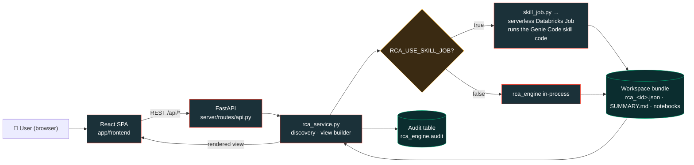

# ReconResolve — Databricks App

A self-serve, Databricks-themed UI on top of the RCA engine. It turns a Lakebridge
reconcile run into a click-through experience: **pick a `recon_id` → dashboard →
drill into a table → export**. It complements the Genie Code skill (the agentic path);
the App is the at-a-glance / non-notebook path.

**Source-agnostic.** RCA works for any Lakebridge-supported source migrating to Databricks
(Snowflake, Oracle, Teradata, SQL Server, Synapse, …) — the engine is dialect-driven and loads a
per-dialect knowledge base. Snowflake is the tested reference bed; switch the source dialect in the
sidebar.

The App is an **orchestrator/reader**: for the actual work it **invokes the Genie Code skill**.
When `RCA_USE_SKILL_JOB=true`, the backend (`server/skill_job.py`) submits the skill's
`job_entry` notebook as a **serverless Databricks Job** — so the skill's own code
(`skill/rca-recon/scripts/run_rca.py`) does reconcile + RCA + notebook publish + audit — then
the app reads the resulting bundle (`rca_<id>.json` + `SUMMARY.md`) back from the workspace and
renders it. With the flag off it falls back to running the same engine in-process. It never
re-implements engine logic.

## Request flow



Whichever mode is active, the engine logic and the published bundle are identical to the CLI
and skill paths — the App is only the front door. The full engine pipeline (reconcile →
Tier-1 → enrichment → Tier-2 → notebook) is diagrammed in the [root README](../README.md).

## Pages
(sidebar order mirrors the workflow) — a **catalog picker** in the sidebar switches the active
data source for every page (`GET /api/catalogs`; each catalog-scoped API takes an optional
`?catalog=` override, defaulting to `RCA_RECON_CATALOG`).
- **Overview** (home `/`) — an **interactive** architecture explainer with two toggleable views:
  a **Process flow** (sources → reconcile → RCA Tier-1 deterministic → RCA Tier-2 LLM fallback →
  outputs, each stage clickable with a live inputs/outputs/runs-on detail panel) and a **Technical
  DFD** (external entities · numbered processes · data stores with labelled data flows). Plus the
  two entry paths and quick-start actions.
- **Trigger recon** — start a reconciliation from the app: pick source/target schemas, tick the
  tables (or add pairs), and run. Join keys are **auto-detected** when omitted, renamed columns are
  handled via a `src:tgt` mapping, and each pair is isolated so one failure never sinks the run. It
  writes a fresh `recon_id` and (by default) continues straight into the full RCA + notebooks.
- **Recon runs** — recent reconcile runs (via `list_recon_runs`) in the active catalog; pick one.
- **Run dashboard** — KPI tiles (overall row match %, verdict counts), verdict-distribution
  donut, **🔺 Top priorities** (severity-ranked), and a per-table scorecard (worst first).
  **▶ Run full RCA & generate notebook** analyzes every table in the run (background job) and
  publishes per-table + index notebooks to the workspace.
- **Analyze (table-by-table)** — run the engine live for one table at a time (fast, ~5s each).
- **Table drill-down** — every finding for a table: severity, verdict, root cause, remediation,
  owner, the 5-source evidence + confirming query, and sample diffs.
- **Audit trail** — append-only history of every reconcile & RCA step (what ran, when, by whom,
  outcome), grouped by `run_id`, with a link back to each run's dashboard + published notebook.

### Trigger a reconcile (app-native)
`Trigger recon` calls `POST /api/recon/trigger` (returns a token; poll `GET /api/recon/job/{token}`),
which runs `rca_engine.reconcile` on the SQL warehouse — comparing source vs. target and writing
Lakebridge-compatible `main`/`metrics`/`details` rows under a new `recon_id` in
`RCA_RECON_CATALOG.RCA_RECON_SCHEMA`. Works whenever both sides are query-able from the warehouse
(the retail test bed keeps `mig_source_sim` + `mig_target` in one catalog). The SP needs **MODIFY**
on the reconcile schema and **SELECT** on the source/target schemas. `GET /api/schemas` and
`GET /api/schemas/{schema}/tables` back the form's pickers. Defaults come from `RCA_SOURCE_SCHEMA`
/ `RCA_TARGET_SCHEMA`.

### Audit trail
Every triggered reconcile and RCA step appends one row to an append-only Delta table
(`RCA_AUDIT_TABLE`, default `<catalog>.<recon_schema>.rca_genie_audit`) via
`rca_engine.audit`. A reconcile row and its RCA row share a `run_id`, so a full pipeline
groups together. `GET /api/audit` reads the recent history for the **Audit trail** page.
Writing is best-effort — a permissions/write failure logs a note and never blocks the RCA.
The SP needs **CREATE TABLE** + **MODIFY** on the containing schema (the table auto-creates
on first write). Set `RCA_AUDIT_TABLE=off` to disable. The same table is written by the
Genie Code skill and CLI, so all three surfaces share one history.

### Full-run RCA + workspace notebooks
`Run full RCA` calls `POST /api/runs/{id}/analyze-all`, which runs the whole run in a background
thread (poll `GET /api/runs/{id}/job`), writes the complete bundle so the dashboard is populated,
and publishes runnable notebooks into `RCA_NOTEBOOK_DIR` (one per table + `00_index`). The app's
service principal needs **CAN_MANAGE** on that workspace folder. The dashboard prefills that folder
from config but lets you **override the notebook target per run** in the field beside the button
(a `rca_<recon_id>/` subfolder is created under whichever base you choose).

## Architecture
```
app/
  app.py                # FastAPI: JSON API + serves the built React SPA
  app.yaml              # Databricks App config (command + env)
  requirements.txt      # backend deps (PyPI only)
  rca_engine/           # vendored engine (kept in sync via `make sync`)
  server/
    config.py           # dual-mode auth + settings (env-driven)
    rca_service.py      # discovery, bundle load, SDK statement runner, UI view builder
    routes/api.py       # /api/config, /api/runs, /api/runs/{id}, /api/runs/{id}/summary
  frontend/             # React + Vite + TS (Databricks dark theme)
  bundles/rca_<uuid>/   # committed demo bundles (3 runs) → the app renders with zero setup
  scripts/make_sample_bundle.py
```

## Run locally
```bash
# 1) Build the frontend (outputs app/frontend/dist)
cd app/frontend && npm install && npm run build && cd ..

# 2) Start the backend (serves API + SPA on :8000). Demo mode needs no workspace.
pip install -r requirements.txt
python -m uvicorn app:app --reload --port 8000
# open http://localhost:8000
```

Frontend dev with hot reload (proxies /api → :8000):
```bash
cd app/frontend && npm run dev    # http://localhost:5173
```

Regenerate the demo bundles: `python scripts/make_sample_bundle.py`. This writes three
recon runs (realistic UUID `recon_id`s) driven by `migration/scenarios.yaml` — a retail
pilot cutover, an edge-case hardening run, and a clean post-fix re-run — so you can exercise
every scenario and the ✅ clean path.

## Configuration (env / `app.yaml`)
| Var | Purpose |
|---|---|
| `RCA_RECON_CATALOG` / `RCA_RECON_SCHEMA` | Where Lakebridge wrote `main`/`metrics`/`details` |
| `RCA_WAREHOUSE_ID` | SQL warehouse for live discovery/reads (bind a warehouse resource) |
| `RCA_BUNDLES_DIR` | Folder of pre-computed bundles (a UC Volume in-workspace, or writable scratch) |
| `RCA_NOTEBOOK_DIR` | Workspace folder the full-run action publishes notebooks into (SP needs CAN_MANAGE) |
| `RCA_SOURCE_SCHEMA` / `RCA_TARGET_SCHEMA` | Defaults prefilled in the Trigger-recon form (SP needs SELECT on both; MODIFY on the reconcile schema) |
| `RCA_AUDIT_TABLE` | Append-only audit table (default `<catalog>.<recon_schema>.rca_genie_audit`; `off` disables; SP needs CREATE TABLE + MODIFY) |
| `RCA_DIALECT` | Default source dialect (picks the knowledge base). Any Lakebridge source; KBs ship for `snowflake`, `oracle`, `teradata`, `mssql`, `synapse`. Users can switch it in the sidebar (`GET /api/dialects`; RCA routes take `?dialect=`) |
| `RCA_LLM_FALLBACK` | `true` to enable the Tier-2 Foundation Model fallback: after the deterministic pass, residual `needs-review`/`unknown` findings are sent to an FM endpoint that proposes a cause **+ a confirming query**, promoted only if the query confirms (never a bare guess) |
| `RCA_LLM_ENDPOINT` | FM serving endpoint for the Tier-2 fallback (default `databricks-meta-llama-3-3-70b-instruct`; SP needs "Can Query") |
| `RCA_USE_SKILL_JOB` | `true` to make the app **invoke the Genie Code skill** as a serverless Databricks Job (skill code does all actions); `false` runs the engine in-process |
| `RCA_SKILL_DIR` | Workspace folder of the deployed skill (contains `scripts/`, `config.yml`); SP needs **CAN_READ** |
| `RCA_SKILL_NOTEBOOK` | The skill's `job_entry` notebook path (imported from `scripts/job_entry.py`) that the job runs |
| `RCA_SKILL_OUT_DIR` | Workspace base the skill job writes `rca_<id>/` bundles + notebooks into; SP needs **CAN_MANAGE** |
| `RCA_ALLOW_ONDEMAND` | `true` to let the dashboard compute a full run on load without a bundle |

With no `RCA_WAREHOUSE_ID`, the App runs in **demo mode** off the bundled sample.

## Deploy (outline)
```bash
databricks apps create rca-genie -p <profile>
databricks sync . /Workspace/Users/<you>/rca-genie \
  --exclude frontend/node_modules --exclude .venv --exclude __pycache__ -p <profile>
databricks apps deploy rca-genie \
  --source-code-path /Workspace/Users/<you>/rca-genie -p <profile>
```
Then bind a **SQL warehouse** resource (and a **UC Volume** for bundles) in the App UI and
set the env vars above. See the repo `databricks-apps` skill for the full deploy/troubleshoot flow.
