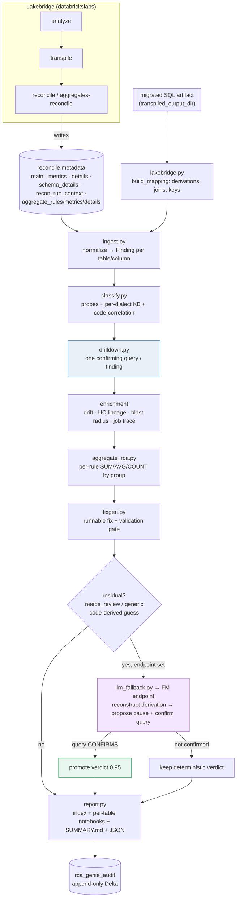
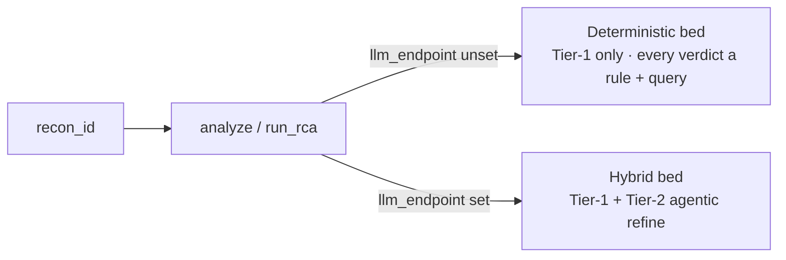

# ReconResolve — architecture & flow

ReconResolve turns a Lakebridge **reconcile** run into a reviewer-ready root-cause notebook.
It has two tiers: a **deterministic** tier (rule-based, every verdict backed by a live query)
and an **agentic** tier (a Foundation Model, always query-gated) that only widens coverage on
the residual and writes the narrative.

## Pipeline

**The rule that keeps it honest:** the deterministic tier concludes and confirms with a query;
the agentic tier is entered only for the residual, and `resolve_finding` promotes a
model-proposed cause **only if its confirming query matches** — otherwise the deterministic
verdict stands. So the LLM widens coverage and writes prose; it never sets a verdict on opinion.

## Two beds, same engine, one flag

## Feature catalogue — deterministic vs agentic

### Deterministic tier (Tier-1) — no LLM, every verdict query-backed

| Feature | Module | Signal |
|---|---|---|
| Ingest & normalize (modern schema + legacy fallback) | `ingest.py` | main/metrics/details/details_columns |
| Classification (probes + per-dialect KB) | `classify.py`, `knowledge/` | recon samples + KB |
| Code-correlation (target derivation, passthrough, load filter) | `classify.py` + `lakebridge.py` | migrated SQL artifact |
| Live drill-down (one confirming query/finding) | `drilldown.py` | source/target tables |
| Schema RCA (type/precision/name, `information_schema`) | `ingest.py` + `drilldown` | schema_details |
| Distribution drift (null-rate/cardinality/numeric) | `drift.py` | source vs target |
| UC lineage trace-back + downstream blast radius | `lineage.py` | system.access.*_lineage |
| Job-level source trace (sqlglot) + reproduction query | `mismatch_trace.py` | building job's ETL SQL |
| Transformation-logic highlight | `report.py` `_transform_logic` | artifact derivation |
| Threshold-aware verdicts (within-tolerance → benign) | `classify.py` + ingest | column/table_thresholds |
| Errored-run triage | `ingest.py` | run_metrics.exception_message |
| Config-from-run_context (no artifacts) | `lakebridge.py` | recon_run_context.config |
| **Aggregate-reconcile RCA (per-rule SUM/AVG/COUNT by group)** | `aggregate_rca.py` | aggregate_rules/metrics |
| Suggested fixes + validation gate | `fixgen.py` | mapping + tables |
| Systemic clustering · severity ranking · report bundle | `cluster.py`,`severity.py`,`report.py` | findings |

### Agentic tier (Tier-2) — FM endpoint, always query-gated

| Feature | Module | Guardrail |
|---|---|---|
| LLM fallback — reconstruct derivation, propose cause + confirming query | `llm_fallback.py` · `--endpoint` / `llm_endpoint` | promoted **only if the query confirms** |
| Multi-table reconstruction (join context: FROM/JOINs + referenced-table schemas) | `resolve.build_evidence_bundle` | model gets real columns, never guesses |
| Grounded narrative (per-table/run summary) | `synthesize.py` | description only — never sets a verdict |
| LLM-as-judge grader (offline quality grading) | `judge.py` · `rca-eval` skill | offline — never affects runtime RCA |
